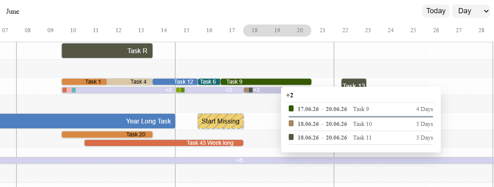

<div align="center" markdown="1">
    <h1>Riel Gantt</h1>

**A modern, configurable Gantt chart library with aggregation support for overlapping tasks.**

</div>



`riel-gantt` is a fork of [Frappe Gantt](https://github.com/frappe/gantt). It keeps the familiar Frappe Gantt API and adds support for multiple tasks in the same logical row, aggregation bars for overlaps, configurable lanes, enhanced popups, custom date formatting and more simplified view configuration.

## Key Features

-   **Multiple tasks per row**: group tasks by `lineIndex` and render overlapping tasks in lanes.
-   **Aggregation bars**: when too many tasks overlap in one row, hidden lower-lane tasks are represented by a compact `+N` aggregation bar.
-   **Priority-aware aggregation**: use a task `priority` to keep important tasks visible in the upper lane.
-   **Aggregation popups**: show aggregate members as a list or table, optionally with a compact Gantt preview.
-   **Custom date formatter**: plug in your application date formatter globally.
-   **View build helpers**: build custom view modes from simplified configuration objects.
-   **Standard Frappe Gantt features**: custom views, ignored periods, localization, dependencies, read-only modes and progress display.

## Installation

```bash
npm install riel-gantt
```

### ES modules

```js
import Gantt from 'riel-gantt';
import 'riel-gantt/dist/riel-gantt.css';
```

### Browser bundle

```html
<script src="riel-gantt.umd.js"></script>
<link rel="stylesheet" href="riel-gantt.css" />
```

### CDN

```html
<script src="https://cdn.jsdelivr.net/npm/riel-gantt/dist/riel-gantt.umd.js"></script>
<link
    rel="stylesheet"
    href="https://cdn.jsdelivr.net/npm/riel-gantt/dist/riel-gantt.css"
/>
```

## Basic Usage

```js
const tasks = [
    {
        id: 'task-1',
        name: 'Visible task',
        start: '2026-01-01',
        end: '2026-01-05',
        progress: 30,
        lineIndex: 0,
        priority: 10,
    },
    {
        id: 'task-2',
        name: 'Overlapping task',
        start: '2026-01-03',
        end: '2026-01-07',
        progress: 10,
        lineIndex: 0,
    },
];

const gantt = new Gantt('#gantt', tasks, {
    view_mode: 'Day',
    row_lanes: 2,
    popup_aggregate_style: 'table',
});
```

Tasks with the same `lineIndex` are rendered in the same logical row. If tasks overlap in time, the chart keeps visible tasks in the upper lane(s) and places lower-lane tasks or aggregation bars below them.

## Task Properties

Riel Gantt supports the standard Frappe Gantt task fields and adds row, priority and styling properties.

| Property | Description                                                                                                                                                           |
| --- |-----------------------------------------------------------------------------------------------------------------------------------------------------------------------|
| `id` | Unique task id. Required.                                                                                                                                             |
| `name` | Task label. Required.                                                                                                                                                 |
| `start` | Task start date. If omitted, please refer to [Handling Incomplete Dates](#handling-incomplete-dates)                                                                  |
| `end` | Task end date. If omitted and no `duration` is set, `default_duration` is used. Refer to [Handling Incomplete Dates](#handling-incomplete-dates) for more information. |
| `duration` | Duration string such as `'2d'`, `'6h'` or combined values separated by spaces like `'1m 3d'`. Used to calculate `end` when `end` is omitted.                          |
| `progress` | Progress percentage.                                                                                                                                                  |
| `dependencies` | Comma-separated dependency ids or an array of ids.                                                                                                                    |
| `lineIndex` | Groups tasks into the same logical row. Tasks without `lineIndex` fall back to their task index.                                                                      |
| `priority` | Numeric priority used by aggregation logic. Higher values are kept visible first when tasks overlap.                                                                  |
| `draggable` | Set to `false` to prevent dragging or resizing this task.                                                                                                             |
| `readonly` | Set to `true` for a task that should not be edited. (not stable)                                                                                                      |
| `custom_class` | Additional CSS class added to the task bar group.                                                                                                                     |
| `color` | Task bar fill color.                                                                                                                                                  |
| `colorHover` | Task bar hover fill color.                                                                                                                                            |
| `progressColor` | Progress bar fill color.                                                                                                                                              |
| `textColor` | Label text color while the label is inside the bar.                                                                                                                   |

## Configuration

| Option | Default | Description                                                                                                                                                                               |
| --- | --- |-------------------------------------------------------------------------------------------------------------------------------------------------------------------------------------------|
| `arrow_curve` | `5` | Curve radius of dependency arrows.                                                                                                                                                        |
| `auto_move_label` | `false` | Moves long task labels with horizontal scrolling. When enabled, labels are also positioned correctly on the initial render.                                                               |
| `bar_corner_radius` | `3` | Task bar corner radius in pixels.                                                                                                                                                         |
| `bar_height` | `30` | Height of a single task bar in pixels.                                                                                                                                                    |
| `container_height` | `'auto'` | Container height. Use `'auto'` to fit the rendered rows or a number for pixels.                                                                                                           |
| `column_width` | `null` | Width of each timeline column. `null` uses the active view mode value.                                                                                                                    |
| `date_format` | `'YYYY-MM-dd HH:mm'` | Default date format used by the chart.                                                                                                                                                    |
| `upper_header_height` | `45` | Height of the upper timeline header in pixels.                                                                                                                                            |
| `lower_header_height` | `30` | Height of the lower timeline header in pixels.                                                                                                                                            |
| `snap_at` | `null` | Snap interval used while resizing or dragging. `null` uses the active view mode value.                                                                                                    |
| `infinite_padding` | `false` | Extends the rendered timeline while scrolling. This option is currently not considered stable.                                                                                            |
| `holidays` | `{ 'var(--g-weekend-highlight-color)': 'weekend' }` | Highlighted holidays. Keys are colors, values are `'weekend'` or date definitions.                                                                                                        |
| `is_weekend` | `(d) => d.getDay() === 0 \|\| d.getDay() === 6` | Function that decides whether a date is a weekend.                                                                                                                                        |
| `ignore` | `[]` | Ignored periods for progress calculation and rendering, for example `'weekend'` or date arrays.                                                                                           |
| `language` | `'en'` | Localization language code.                                                                                                                                                               |
| `lines` | `'both'` | Grid lines: `'none'`, `'vertical'`, `'horizontal'` or `'both'`.                                                                                                                           |
| `move_dependencies` | `true` | Moves dependent tasks automatically when a task is moved.                                                                                                                                 |
| `padding` | `18` | Legacy padding around bars. With aggregation layouts, vertical spacing is mainly controlled by row and lane options.                                                                      |
| `popup` | Default popup renderer | Function used to render task and aggregation popups. See [Popup Configuration](#popup-configuration).                                                                                     |
| `popup_on` | `'click'` | Popup trigger: `'click'` or `'hover'`.                                                                                                                                                    |
| `readonly_progress` | `false` | Disables progress editing.                                                                                                                                                                |
| `readonly_dates` | `false` | Disables date editing.                                                                                                                                                                    |
| `readonly` | `false` | Disables all editing.                                                                                                                                                                     |
| `scroll_to` | `'today'` | Initial scroll target: `'today'`, `'start'`, `'end'` or a date value.                                                                                                                     |
| `show_expected_progress` | `false` | Shows the expected progress overlay.                                                                                                                                                      |
| `today_button` | `true` | Shows a button that scrolls to today.                                                                                                                                                     |
| `on_today_missing` | `null` | Callback called when `scroll_current()` is triggered but today is outside the rendered interval. Signature: `(today, gantt_start, gantt_end)`.                                            |
| `view_mode` | `'Day'` | Initial view mode name or view mode object.                                                                                                                                               |
| `view_mode_select` | `false` | Shows a view mode dropdown.                                                                                                                                                               |
| `view_modes` | Default Day, Week, Month, Year modes | Available view modes. See [View Mode Configuration](#view-mode-configuration).                                                                                                            |
| `label_overflow` | `'outside'` | Label behavior when it does not fit inside the bar: `'outside'` or `'clip'`. Use `'clip'` if aggreagtions are used to prevent the label from overlaping with the next task on the same row. |
| `label_outside_color` | `'#555'` | Label color used when `label_overflow: 'outside'`.                                                                                                                                        |
| `lane_padding` | `4` | Vertical spacing between lanes inside the same row.                                                                                                                                       |
| `row_height` | `null` | Fixed row height. If `null`, it is calculated from `bar_height + padding`.                                                                                                                |
| `bar_inner_padding` | `6` | Total vertical inner padding within a row for task bars.                                                                                                                                  |
| `row_keys` | `null` | Explicit row order and row list. Useful for rendering empty rows or stable row ordering.                                                                                                  |
| `default_duration` | `2` | Duration in days used for tasks with missing start or end information.                                                                                                                    |
| `start_of_week` | `'monday'` | Week alignment start. Use `'monday'`; `'sunday'` is present but not stable.                                                                                                               |
| `include_today_in_padding` | `false` | Extends the padded date range so today is included. Experimental.                                                                                                                         |
| `global_min_view_start` | `null` | Minimum start date included before view padding is applied.                                                                                                                               |
| `global_min_view_end` | `null` | Minimum end date included before view padding is applied.                                                                                                                                 |
| `stripe_rows` | `false` | Enables classic alternating row background colors.                                                                                                                                        |
| `popup_aggregate_style` | `'list'` | Aggregation popup member layout: `'list'` or `'table'`. The table layout is experimental.                                                                                                 |
| `popup_aggregate_include_upper_row_tasks` | `true` | Includes overlapping visible upper-lane tasks in aggregation popups. Set to `false` to show only aggregate members.                                                                       |
| `date_formatter` | `null` | Optional global formatter function. Signature: `(date, format_string, lang)`.                                                                                                             |
| `date_format_default` | `'YYYY-MM-DD HH:mm:ss.SSS'` | Fallback format passed to `date_formatter` when no explicit format is supplied.                                                                                                           |
| `row_lanes` | `2` | Number of vertical lanes per row. The last lane is reserved for lower tasks or aggregation bars. Minimum value is `2`.                                                                    |
| `popup_aggregate_expand_tasks` | `false` | Shows a compact Gantt chart next to the aggregation popup task list. Experimental.                                                                                                        |
| `popup_aggregate_gantt_width` | `360` | Width in pixels for the compact popup Gantt. Used only when `popup_aggregate_expand_tasks` is `true`.                                                                                     |

## Aggregation Behavior

Aggregation is based on `lineIndex` and time overlap:

1. Tasks with the same `lineIndex` are placed in the same logical row.
2. The chart chooses visible upper-lane tasks using interval scheduling.
3. If a row contains numeric `priority` values, higher priority tasks are selected first.
4. Tasks that cannot fit in the upper lanes are moved to the reserved lower lane.
5. If two or more lower-lane tasks overlap, they are replaced by an aggregation bar named `+N`.
6. Clicking the aggregation bar opens a popup with the aggregated members.

Use `row_lanes` in combination with `row_height` to allow more visible upper lanes:

```js
new Gantt('#gantt', tasks, {
    row_lanes: 3, // two visible upper lanes, one lower aggregation lane
    row_height: 52, // enough height for three lanes
});
```

Use `row_keys` to enforce stable row ordering or render rows even when they have no tasks:

```js
new Gantt('#gantt', tasks, {
    row_keys: [1,2,3,4,5],
});
```
This example will display 5 rows, even if some of them have no tasks. Useful for rendering empty rows or when tasks are dynamically added to the chart.

## Handling Incomplete Dates

Tasks may omit `start`, `end` or both. Incomplete tasks are visually marked and rendered using the Gantt option `default_duration`:

```js
new Gantt('#gantt', [
    { id: 'a', name: 'Starts today automatically' },
    { id: 'b', name: 'Known start', start: '2026-01-10' },
    { id: 'c', name: 'Known end', end: '2026-01-20' },
    { id: 'd', name: 'Known end', start: '2026-01-10', duration: '5d' },
], {
    default_duration: 2,
});
```

- If task `duration` is provided and `end` is missing, the end date is calculated from `start + duration`.
    - if the `duration` is missed and `end` is missing, the end date is calculated from `start + default_duration`.
- If `start` is missing and `end` is provided, the start date is calculated from `end - default_duration`. 
- If both `start` and `end` are missing, the task is placed at the current date with a duration of `default_duration`.

## View Mode Configuration

The `view_modes` option defines all available timeline views. It is an array of objects.

| Property | Description |
| --- | --- |
| `name` | View mode name. |
| `padding` | Timeline padding around the task range, for example `'7d'`, `'1m'` or `[left, right]`. |
| `today_button_left_scroll_padding` | Optional left-side offset used when the Today button scrolls. Uses the same duration format as `padding`; if an array is supplied, the left value is used. |
| `step` | Timeline column interval, for example `'1d'`, `'7d'`, `'1m'` or `'1y'`. |
| `date_format` | Date format used by this view mode. |
| `column_width` | Column width for this view mode. |
| `snap_at` | Drag and resize snap interval for this view mode. |
| `lower_text` | Lower header formatter string or function `(currentDate, previousDate, lang)`. |
| `upper_text` | Upper header formatter string or function `(currentDate, previousDate, lang)`. |
| `upper_text_frequency` | Performance hint for how often upper text has a value. |
| `thick_line` | Function that decides whether a timeline line is emphasized. |

Example:

```js
const viewModes = [
    {
        name: 'Day',
        padding: '7d',
        today_button_left_scroll_padding: '3d',
        step: '1d',
        date_format: 'YYYY-MM-dd',
        column_width: 45,
        lower_text: 'dd',
        upper_text: 'MMMM',
    },
];

new Gantt('#gantt', tasks, {
    view_modes: viewModes,
    view_mode: 'Day',
});
```

When custom `view_modes` are supplied, an explicitly configured `view_mode` is respected if it exists in the custom list. Otherwise, the first custom view mode is used.

## Simple View Mode Config

`view_modes` also accepts a simplified configuration object directly. Riel Gantt detects this shape automatically and converts the simplified header and thick line definitions internally.

```js
new Gantt('#gantt', tasks, {
    view_modes: {
        Day: {
            padding: '7d',
            today_button_left_scroll_padding: '3d',
            step: '1d',
            date_format: 'YYYY-MM-dd',
            column_width: 45,
            header: {
                upper: { date_format: 'MMMM', interval: 'Month' },
                lower: { date_format: 'dd', interval: 'Date' },
            },
            thick_line: { interval: 'week', value: 1 },
        },
    },
});
```

Most standard view mode properties from [View Mode Configuration](#view-mode-configuration) can be used unchanged. The simplified config differs only in how view modes are named and how header and thick line helpers are described:

| Property | Description |
| --- | --- |
| `view_modes` object keys | The object key is used as the view mode `name`, for example `Day`, `Week` or `Monat_Prod`. A `name` property inside the view mode can still be used and takes precedence. |
| `header` | Simplified replacement for `upper_text` and `lower_text`. It can define `header.upper` and `header.lower`. If classic `upper_text` or `lower_text` are also set, they take precedence over `header`. |
| `header.upper` | Definition for the upper timeline header. Converted internally to `upper_text`. |
| `header.lower` | Definition for the lower timeline header. Converted internally to `lower_text`. |
| `header.*.date_format` | Format used for normal header cells. If `interval` is not set, this format is used for every cell. |
| `header.*.date_format_at_border` | Optional format used when the configured `interval` boundary changes. If omitted, `date_format` is used. |
| `header.*.interval` | Boundary detector for the header text. Supported values are `Date`, `Day`, `Month`, `Year` and `Decade`. If omitted, no boundary check is applied. |
| `header.*.date_format: '~weekRange'` | Special lower-header token for week views. It renders a range such as `01 Jan - 07`. |
| `header.*.date_format_at_border: '~decade'` | Special token for decade labels, for example `2020`, `2030`. |
| `thick_line` object | Simplified replacement for a `thick_line` function. If a classic `thick_line` function is supplied, it is used unchanged. |
| `thick_line.interval: 'week'` | Emphasizes days where `date.getDay()` equals `thick_line.value`. Example: `value: 1` for Monday. |
| `thick_line.interval: 'month_range_in_days'` | Emphasizes dates where the day of month is between `thick_line.from` and `thick_line.to`. |
| `thick_line.interval: 'year_quarter'` | Emphasizes quarter starts inside the rendered interval, useful for wider steps such as weekly quarter views. |

Supported header helper tokens include `~weekRange` for week ranges and `~decade` for decade labels.

## Popup Configuration

`popup` is a function. If it returns:

-   `false`, no popup is shown.
-   `undefined`, the popup is rendered by mutating the supplied popup context.
-   an HTML string, that string is used as popup content.

The function receives one context object:

```js
new Gantt('#gantt', tasks, {
    popup(ctx) {
        ctx.set_title(ctx.task.name);
        ctx.set_subtitle(ctx.task.description || '');
        ctx.set_details('Custom details');
    },
});
```

Context properties:

| Property | Description |
| --- | --- |
| `task` | Current task or aggregation bar. |
| `chart` | The Gantt instance. |
| `get_title`, `get_subtitle`, `get_details` | Read popup section nodes. |
| `set_title`, `set_subtitle`, `set_details` | Set popup section HTML. |
| `add_action` | Adds an action button. Signature: `(html, callback)`. |

### Aggregation popup options

```js
new Gantt('#gantt', tasks, {
    popup_aggregate_style: 'table',
    popup_aggregate_include_upper_row_tasks: true,
    popup_aggregate_expand_tasks: true,
    popup_aggregate_gantt_width: 420,
});
```

`popup_aggregate_expand_tasks` creates a nested read-only Gantt inside the popup. The nested chart uses the same view mode as the main chart, disables recursive aggregation popups and renders one task per popup row.

## Date Formatting

By default, the package uses its built-in date formatter. To use an application formatter, pass `date_formatter`:

```js
new Gantt('#gantt', tasks, {
    date_formatter: window.exfTools.date.format.bind(window.exfTools.date),
    date_format_default: 'yyyy-MM-dd HH:mm:ss.SSS',
});
```

The formatter receives `(date, format_string, lang)`. `date_format_default` is used when the chart formats a date without an explicit format.

## Scrolling and Refreshing

Initial scrolling is controlled by `scroll_to`.

```js
new Gantt('#gantt', tasks, {
    scroll_to: 'today',
});
```

`refresh(tasks)` preserves the current horizontal `scrollLeft` by default. This prevents repeated data updates from jumping back to `scroll_to`.

```js
gantt.refresh(tasks);          // keep exact current horizontal scroll position
gantt.refresh(tasks, true);    // apply options.scroll_to
gantt.refresh(tasks, 'today'); // explicitly scroll to today
gantt.refresh(tasks, 'start'); // explicitly scroll to start
gantt.refresh(tasks, date);    // explicitly scroll to a Date
```

Use `on_today_missing` to react when today is outside the rendered interval:

```js
new Gantt('#gantt', tasks, {
    on_today_missing(today, gantt_start, gantt_end) {
        console.log('Today is outside the rendered interval', {
            today,
            gantt_start,
            gantt_end,
        });
    },
});
```

`include_today_in_padding: true` can extend the rendered date range so today is present even when it is outside the task range.

## API

| Method | Description |
| --- | --- |
| `update_options(new_options)` | Updates options and re-renders the chart. |
| `change_view_mode(view_mode, maintain_pos)` | Changes the current view mode. `view_mode` can be a name or a view mode object. |
| `scroll_current(animate = true, trigger_today_missing = false)` | Scrolls to today if it is inside the rendered interval. |
| `update_task(task_id, new_details)` | Updates and re-renders one task bar. |
| `refresh(tasks, scroll_after_refresh = false)` | Replaces tasks and re-renders the chart. By default it preserves the current horizontal scroll position. |

## Development Setup

```bash
npm install
npm run build
```

Use `npm run dev` to build in watch mode.

<br />
<br />